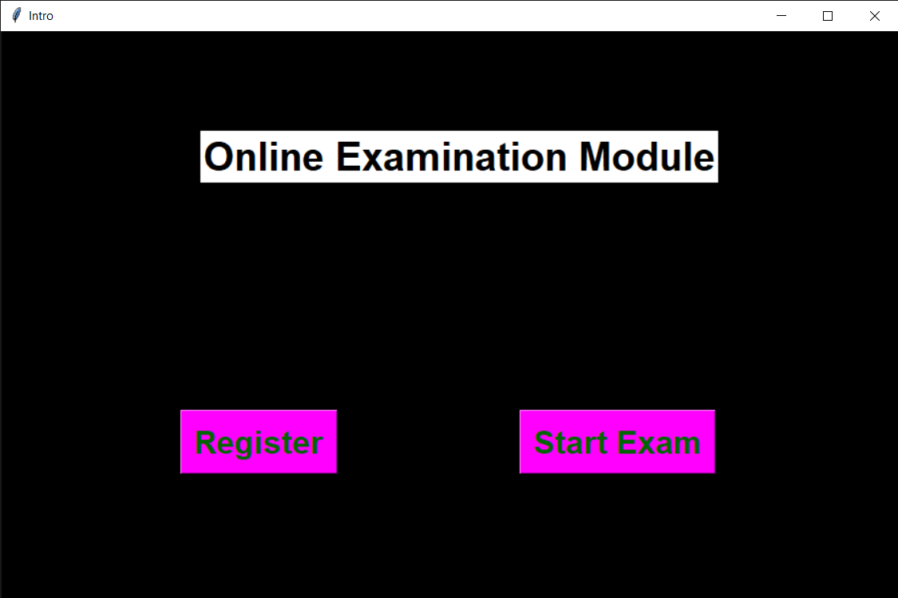
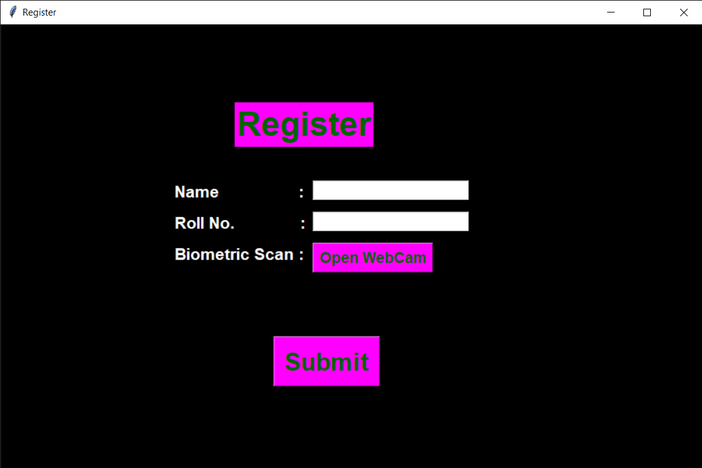

# Exam_Monitoring_System

This system can monitor and detect any unusual movement of a candidate giving an exam. This is an automated system that registers a newly signing candidate via his/her biometrics and takes the attendance and timing of entry of an already registered examinee also via his/her biometrics. 

This model is an end-to-end implementation of a ML model used to predict the person giving the exam from his/her biometrics and monitors whether some unusual activities takes place while giving the exam which leads to termination of the exam then and there.

# Description:

## Model Performance

The model has an accuracy of 97% on the test dataset used in the project.

## Dependencies

The python version used in this project is 3.8.x.
* Python Libraries used in project:
    1. tkinter
    2. OpenCV
    3. numpy
    4. PIL
    5. pandas
    6. datetime

## Executing program

After installing all the dependencies, clone the repository into your local drive and then execute the final.py file and the user-friendly interface will open.

## Snippets from the Interface

1. First page of the interface

2. Register Page 

3. Start Exam Page

## Contributors

Contributor names and contact info:

Amanjeet Pani 
GitHub : [@AmanjeetPani](https://github.com/AmanjeetPani) 
Email : amanjeetpani2405@gmail.com

Anshuman Sandhibigraha 
Github : [@anshusandhi6](https://github.com/anshusandhi6) 
Email : anshusandhi6@gmail.com 

## Version History

* 0.1
    * Initial Release

## Acknowledgments

* [Stack Overflow](https://stackoverflow.com)
